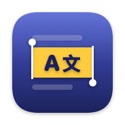
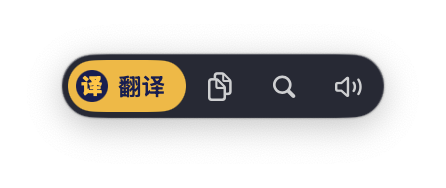
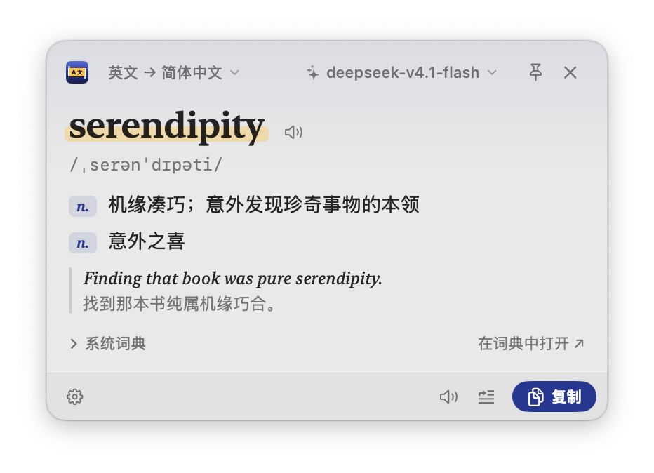
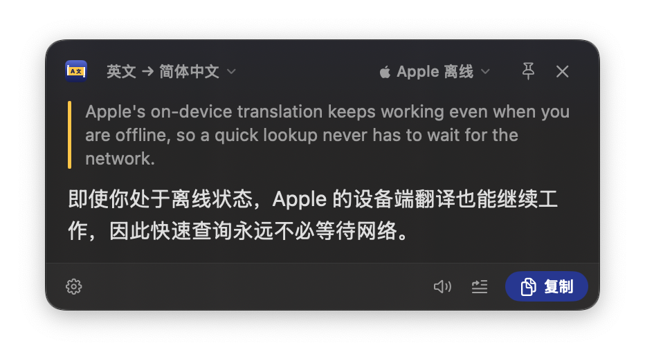
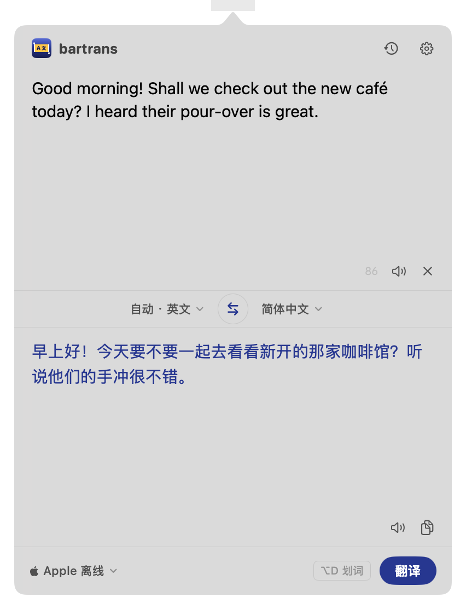
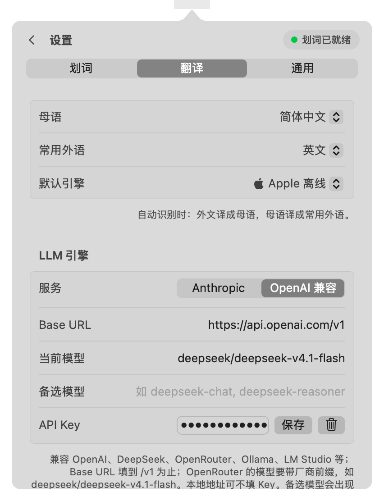

<p align="center">
  
</p>

<h1 align="center">bartrans</h1>

<p align="center">
  macOS 全局划词翻译 / 查词工具 —— 像 PopClip 一样，选中即译。<br>
  纯 Swift + SwiftUI / AppKit，零第三方依赖。
</p>

<p align="center">
  <a href="LICENSE"></a>
  
  
</p>

<p align="center">
  <a href="https://bartrans.met4.org">官网 bartrans.met4.org</a> ·
  <a href="https://github.com/czllll/bartrans/releases/latest">下载最新版</a>
</p>

<p align="center">
  <br>
  
  
</p>

## 功能

**划词**
- 在任意 App 里拖选、双击、三击或 Shift+点击选中文字，选区上方弹出工具条：`翻译 / 复制 / 搜索 / 朗读`
- 也可以设为「直接翻译」：选中后直接弹出结果；或者只用快捷键（默认 `⌥D`）
- 浮窗总是放在选区旁边空间更大的一侧，只朝远离选区的方向伸展，不会挡住划的词
- 读取选中文字优先用辅助功能 API（零副作用）；Chrome、VS Code 等读不到时，模拟 ⌘C 读取并立即还原剪贴板
- 密码框不触发；可以按 App 停用

**翻译与查词**
- 单词 / 短语自动进入查词模式：音标、词性、释义、例句，附带 macOS「词典」App 的离线释义
- 译文流式逐字输出；可朗读、复制，或一键用译文**替换**原文（写邮件时中译英很方便）
- 引擎：Apple 离线翻译（免费、离线），或 LLM —— Anthropic、任意 OpenAI 兼容接口（OpenAI / DeepSeek / OpenRouter / Ollama / LM Studio…）
- 引擎菜单里直接切换服务与模型；设置里有连接测试，显示首字延迟与总耗时
- 母语 / 常用外语可配置，自动判断翻译方向；支持中（简 / 繁）英日韩法德西俄

**菜单栏面板**
- 点击菜单栏图标：手动输入或粘贴翻译，自动填入剪贴板内容
- 历史记录（可搜索）和设置在面板的背面，翻转切换

<p align="center">
  
  
</p>

## 安装

### 下载

在 [Releases](https://github.com/czllll/bartrans/releases) 或 [官网](https://bartrans.met4.org) 下载 `bartrans-macOS.dmg`，把 bartrans 拖进「应用程序」。

应用没有经过 Apple 公证，首次打开如果提示"无法验证开发者"，在终端执行：

```bash
xattr -dr com.apple.quarantine /Applications/bartrans.app
```

### 从源码构建

需要 Xcode 16+（Swift 6 工具链）和 macOS 15+。

```bash
git clone https://github.com/czllll/bartrans.git
cd bartrans
./build_app.sh            # 生成 .build/release/bartrans.app（arm64 + x86_64）
open .build/release/bartrans.app
```

`build_app.sh` 会优先用钥匙串里的 Apple Development / Developer ID 证书签名（也可以用 `SIGN_IDENTITY` 指定），找不到才用 ad-hoc 签名。
系统是按签名记住辅助功能授权的：ad-hoc 签名每次构建都会变，每次重新构建后都要重新授权。

其它脚本：`./build_dmg.sh` 打包 DMG，`scripts/make_icon.sh` 从矢量源重新生成 App 图标。

### 首次使用

1. 启动后只出现在菜单栏（没有 Dock 图标）
2. 按提示在「系统设置 → 隐私与安全性 → 辅助功能」中打开 bartrans —— 划词依赖这项权限
3. 用 LLM 引擎的话，在设置 → 翻译里填好 API Key（保存在钥匙串中），点「测试当前模型」确认可用

## 使用技巧

| 操作 | 方式 |
| --- | --- |
| 翻译选中文字 | 选中后点工具条「翻译」，或按 `⌥D` |
| 复制译文 | 浮窗里 `⇧⌘C` |
| 关闭浮窗 | `Esc` 或点击别处；📌 固定后点别处不关闭 |
| 在某个 App 里停用划词 | 在该 App 前台时右键菜单栏图标 |
| 切换模型 | 浮窗 / 面板里的引擎菜单；备选模型在设置里用逗号分隔填写 |

## 代码结构

```
Sources/bartrans/
├── App/            入口、菜单栏图标 / 面板 / 右键菜单
├── Selection/      划词：全局鼠标监听、读取选中文字、辅助功能权限、全局快捷键
├── Popup/          划词工具条、结果浮窗、浮动面板、调度（SelectionController）
├── Engines/        引擎协议、Apple 翻译、LLM（SSE 流式）、语言识别、词典 / 朗读
├── Storage/        设置、历史、钥匙串
└── Views/          菜单栏面板、设置、历史、图标与共用组件
```

几个实现细节：

- **Apple 翻译**：`Translation` 框架只能通过挂在视图上的 `.translationTask` 调用，每个界面各挂一个隐藏的桥接视图，把它包装成普通的 async 函数（`Engines/SystemEngine.swift`）
- **不抢焦点的浮窗**：`NSPanel` + `.nonactivatingPanel`，弹出时用户原来的 App 保持激活（`Popup/FloatingPanel.swift`）
- **没有沙盒**：读取其它 App 的选中文字、模拟按键都无法在 App Sandbox 内完成

## 隐私

- 不收集任何数据，没有统计和上报
- 使用 Apple 离线引擎时，文字不会离开本机；使用 LLM 引擎时，文字只发送给你配置的服务
- API Key 保存在 macOS 钥匙串中

## License

[MIT](LICENSE)
